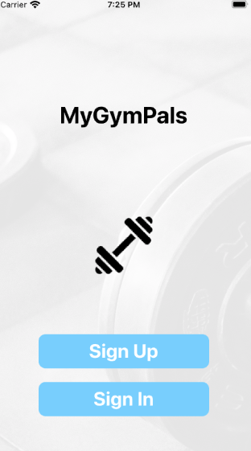

#  MyGymPals
### Kareha Agesa - [Ada Developers Academy](https://adadevelopersacademy.org/) Cohort 14 Capstone Project

# What Is It?
We're in a pandemic.. Gyms are closed.. But you want to work out! I get it. But it can be super hard to stay motivated trying to do yoga in your living room everyday. Enter.... _MyGymPals_! With this app, you can create a customized profile based on your workout preferences (ie. what types of workouts you like to do, how often you workout, and what time of day you like to workout), and find other people who share your workout preferences! Find a new workout buddy, message them, and go forward making gains with your new gym pal!

# Set Up
### Tech Stack

## Resources that inspired this